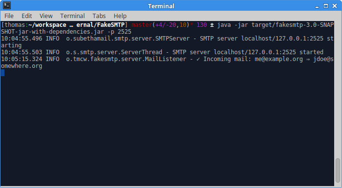

# 📨 Fake-SMTP 

FakeSMTP is a Free Fake SMTP Server ~~with GUI~~ for testing emails in applications easily.

You can use it as a normal SMTP server in your applications. All emails will be intercepted and processed by this software.

FakeSMTP is free to use for commercial and non-commercial projects and the
source code is provided.

## Setup

### Native

    curl -Lo /opt/fakesmtp.jar https://github.com/thomas-mc-work/fakesmtp/raw/master/fakesmtp-3.0.jar

You might want to define an alias somewhere (e.g. in `$HOME/.bashrc`) to shorten the execution line:

    alias fakesmtp='java -jar /opt/fakesmtp.jar'

### Create system.d service

First you need to create the unit file in `/etc/systemd/system/unit`:

    [Unit]
    Description=FakeSMTP server

    [Service]
    ExecStart=/usr/bin/java -jar /opt/fakesmtp.jar -o /data/mail-output
    Restart=always

Next you have to reload the systemd settings:

    systemctl reload fakesmtp

Then you can check the status, start the service and finally enable it for autostart:

    systemctl status fakesmtp
    systemctl start fakesmtp
    systemctl enable fakesmtp

### Docker

This image is not (yet) on docker hub, so you need to create it locally:

    docker build -t tmcw/fakesmtp:latest github.com/thomas-mc-work/fakesmtp
    docker run -d -p 2525:25 -v /path/to/mail-output:/output tmcw/fakesmtp

The default behaviour is to write all emails to `/output`. You can override this parameter of course.

## Usage

CLI usage:

    Usage: java -jar fakesmtp-jar [-hvV] [-b=<bindAddress>] [-c=<cliCommand>]
                                  [-o=<outputPath>] [-p=<portNumber>]
                                  [-r=<relayDomains>]...
    Fake SMTP server with configurable output.
      -b, --bind-address=<bindAddress>
                                  IP address or hostname to bind to.
      -c, --cli-command=<cliCommand>
                                  Full path to an executable in the file system
      -h, --help                  Print usage help
      -o, --output-path=<outputPath>
                                  Emails output directory
      -p, --port=<portNumber>     SMTP port number
      -r, --relay-domains=<relayDomains>
                                  Comma separated email domain(s) for which relay
                                    is accepted. If specified, relays only emails
                                    matching these domain(s), dropping (not saving)
                                    others (default: allow any domain)
      -v, --verbose               Enable DEBUG logging
      -V, --version               print version

### CommandLine script Handler

The selected script via `-c` can make use of these environment variables:

- `$MAIL_FROM`
- `$MAIL_TO`
- `$MAIL_SUBJECT`
- `$MAIL_BODY`

### Example usage: SMTP2XMPP gateway

A sendxmpp config file (`$HOME/.sendxmpprc`):

    user@host s3cr3t-password

A shell script:

    #!/usr/bin/env sh

    printf "From: ${MAIL_FROM}
    To: ${MAIL_TO}
    Subject: ${MAIL_SUBJECT}
    Body:

    ${MAIL_BODY}" | sendxmpp "user@xmpp-host.org" -s "email received" -r   "cli client"

Starting the STMP server:

    java -jar fakesmtp.jar -c "/path/to/the-wrapper-script.sh"

### Example usage: observe all mails

You can replace the former existing GUI by this cli command:

    inotifywait -mre create "/path/to/output" | while read dir event file; do
        echo "°°°°°°°°°°°"
        cat "${dir}${file}"
    done

## Metrics

- Memory footprint: ~23 MB
- Jar file size: 1.6 MB
- Startup time: ~0.27 s

## EML viewers

You can use the following open tools to view the eml files:

- Mozilla Thunderbird `heavyweight` (There is no need to create an account even though it's asking for it)
- Gnome Evolution `heavyweight`
- mpack `lightweight` `command line`

## Development

First of all: **Contributions are welcome**!

### Implement a new mail handler

You can simply implement the `org.tmcw.fakesmtp.spi.MailHandler` interface to add a new behaviour to received emails.
You also nedd to add your handler to the `mailHandlerList`
[somewhere here](https://gitlab.com/thomas-mc-work/fakesmtp/src/main/java/cli/Main.java#40).

### Testing

There are three test layers that you can use to verify your changes:

- Unit Test: `mvn test`
- [Mutation Test](http://pitest.org/) (testing the quality of the unit tests):
`mvn -Dthreads=4 -DwithHistory org.pitest:pitest-maven:mutationCoverage`
- Integration Test: `mvn failsafe:integration-test failsafe:verify`
- System Test: `./run-st.sh` (requires the `docker` + `jq` tools in your system)

If you plan to implement a feature and you feel unable to provide the tests – that's ok! I can try to add them later.

### I can't import the project on Eclipse IDE

Run the following command to create eclipse project files:

    mvn eclipse:eclipse

## Alternatives

From the former FakeSMTP author:

> FakeSMTP was created because we couldn't find any free (as in freedom) and cross-platform SMTP server with GUI for
testing emails in applications or websites. Listed below are some greats alternatives to Fake SMTP:

- [FakeSMTP legacy](http://nilhcem.com/FakeSMTP/)
    - ± has a nice GUI
    - ➕ written in Java
    - ➕ Open source
    - ➕ Lightweight
    - ➖ output is not configurable
- [SMTP4dev](http://smtp4dev.codeplex.com/)
    - ➕ Nice features
    - ➕ Open source
    - ➖ Written for Windows in .net
- [DevNull SMTP](http://www.aboutmyip.com/AboutMyXApp/DevNullSmtp.jsp)
    - ➕ Lightweight
    - ➖ Closed source
    - ➕ Written in Java 1.4 (cross platform)

## Origin

This software is based on the the work by
[Gautier MECHLING aka Nilhem](https://github.com/Nilhcem): <https://github.com/Nilhcem/FakeSMTP>

✌ Thank you very much for your effort and inspiration! ✌

### Changes from FakeSMTP

- migration to Java SE 7
- removed the GUI
- make the output processing modular
- changed the output filename timestamp format to ISO alike
- add four testing layers for better quality control

**Developer related:**

- lots of code cleanups and simplifications
- remove some unused dependencies
- many refactorings (e.g. removed enum based singletons)
- removed the site generation
